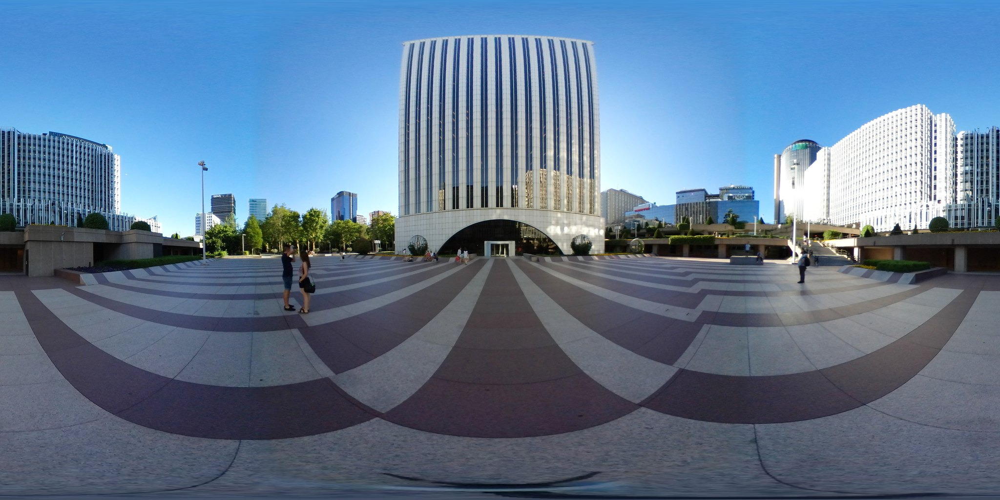

# 360-Degrees-Image-Viewer

 360 degrees image viewer is developed using PHP, CSS and JavaScript. Talking about the project, it contains a user side where a user can post photos easily. This project contains limited features which is only related to a image viewer. In this project, the user has to perform all the main functions from the user side.

Front end: HTML, CSS, JavaScript

 HTML: HTML is used to create and save web document. E.g. Notepad/Notepad++
 CSS : (Cascading Style Sheets) Create attractive Layout
 Bootstrap : responsive design mobile freindly site
 JavaScript: it is a programming language, commonly use with web browsers.
 Back end: PHP, MySQL

 PHP: Hypertext Preprocessor (PHP) is a technology that allows software developers to create dynamically generated web pages, in HTML, XML, or other document types, as per client request. PHP is open source software.


File Structure
```
├── 360.php
├── Database
│   └── image.sql
├── README.md
├── dbconfig.php
├── delete.php
├── images
│   ├── 1.jpg
│   └── img360.jpg
└── index.php
```
2 directories, 8 files


#Each file/folder will contain the following:

 ```360.php``` — We will be able to view 360 images that we have uploaded.

``` index.php``` — This file will be used to upload images and insert the image information into our MySQL database, this is basically our home page.

``` delete.php``` — This file will be used to delete an image from our server and image information from our MySQL database.

``` dbconfig.php``` — We included the dbconfig. php file into the script by using the require_once function. Inside the try block, we created a new PDO object with three arguments: connection string, username, and password. The connection string is composed of `$host` and `$dbname` variables in the `dbconfig. php` file.


#Creating the Database and setting-up Tables
 For this part, you will need to access your MySQL database, either using phpMyAdmin (included with XAMPP) or your preferred MySQL database management application.

If you're using phpMyAdmin follow these instructions:

 Navigate to ```http://localhost/phpmyadmin/```
 Click the `Databases` tab at the top
 Under `Create database`, type in 'image' in the text box
 Select utf8_general_ci as the collation (UTF-8 is the default encoding in HTML5)
 Click `Create`
 This will create the database we're going to use, now we need to create the table and insert example images, instead of manually doing this we can simply execute the below SQL, just remember to select the 'image' database first and click the SQL tab located at the top.
    
This will create the images table with the following columns:

` id `— The unique identitifier of the record.
` image_name` — The title of the image.
` short_description` — The description of the image.
#Sample images


